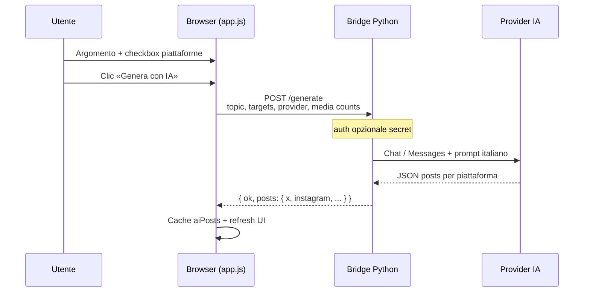
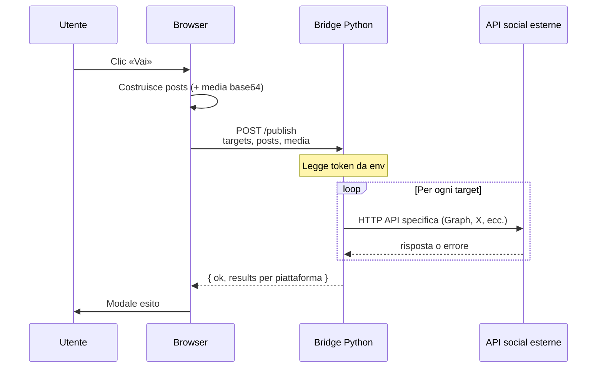
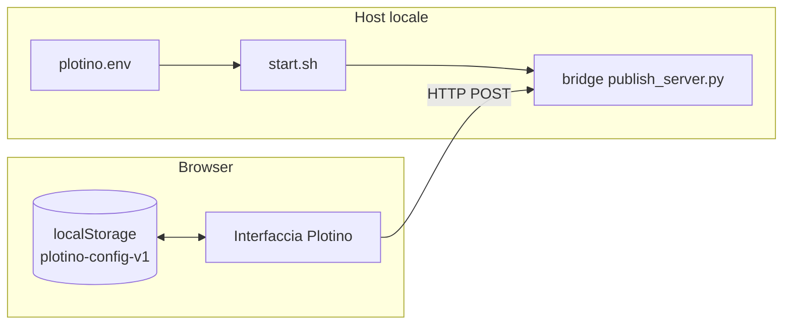

# Diagrammi — Plotino

Diagrammi in **Mermaid** (supportati su GitHub nella visualizzazione Markdown). Utile per onboarding tecnico.

---

## Generazione contenuti con IA

---

## Pubblicazione sul bridge

---

## Flusso dati configurazione

La configurazione **bridge URL / IA** è nel browser; i **segreti sensati** restano preferibilmente in `plotino.env` process environment del processo bridge.
